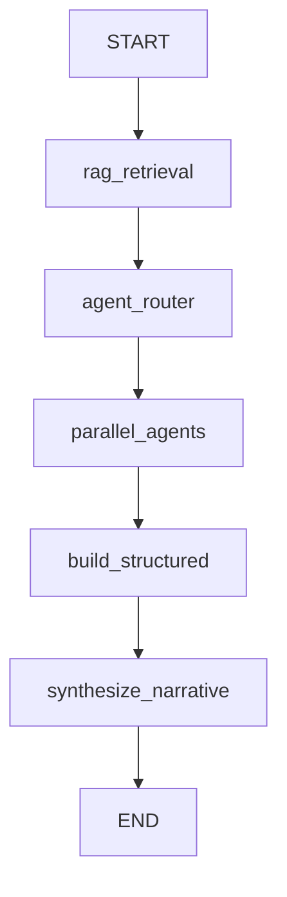

# Phase 2: LangSmith & LangGraph - COMPLETE

## Overview
Successfully completed Phase 2, implementing LangSmith tracing and a complete LangGraph-powered orchestration system with state management, parallel execution, and checkpointing.

## What Was Implemented

### 1. LangSmith Tracing Integration

**Files Created:**
- `src/writeros/utils/langsmith_config.py` - LangSmith configuration utilities
- `.env.example` - Updated with LangSmith environment variables

**Features:**
- Automatic tracing configuration on import
- Environment-based enable/disable (LANGCHAIN_TRACING_V2)
- Project organization (LANGCHAIN_PROJECT)
- URL generation for trace viewing
- Safe handling of missing/placeholder API keys

**Usage:**
```python
from writeros.utils.langsmith_config import configure_langsmith, is_langsmith_enabled

# Enable tracing
configure_langsmith(enabled=True, project_name="writeros-debug")

# Check status
if is_langsmith_enabled():
    url = get_langsmith_url()
    print(f"View traces at: {url}")
```

**Environment Variables:**
```bash
# Enable LangSmith tracing
LANGCHAIN_TRACING_V2=true
LANGCHAIN_API_KEY=your-langsmith-api-key-here
LANGCHAIN_PROJECT=writeros
```

### 2. LangGraph Orchestrator (`src/writeros/agents/langgraph_orchestrator.py`)

**Architecture:**

```
OrchestratorState (TypedDict)
├── Input: user_message, vault_id, conversation_id
├── RAG Context: rag_documents, rag_entities, context_str
├── Agent Execution: selected_agents, agent_responses
├── Structured Analysis: timeline_analysis, psychology_analysis, etc.
└── Output: structured_summary, narrative_summary, final_output
```

**Workflow Nodes:**

1. **rag_retrieval** - Iterative RAG with 10 hops
   - Retrieves relevant documents and entities
   - Formats context for agents
   - Updates: `rag_documents`, `rag_entities`, `context_str`

2. **agent_router** - Agent selection
   - Determines which agents should respond
   - Currently broadcasts to all agents
   - Future: LLM-based intelligent routing
   - Updates: `selected_agents`

3. **parallel_agents** - Parallel execution
   - Executes agents concurrently (LangGraph handles parallelization)
   - Autonomy check (keyword-based, upgradeable to LLM)
   - Error handling per agent
   - Updates: `agent_responses`, individual analysis fields

4. **build_structured** - Structured summary
   - Formats agent responses into systematic analysis
   - Organizes by analysis type (timeline, psychology, travel, etc.)
   - Updates: `structured_summary`

5. **synthesize_narrative** - Natural language synthesis
   - Creates conversational response
   - Combines structured + narrative outputs
   - Updates: `narrative_summary`, `final_output`

**Workflow Graph:**


**Key Features:**

**State Management:**
```python
class OrchestratorState(TypedDict):
    # Annotated fields accumulate with 'add' operator
    rag_documents: Annotated[List[Dict], add]
    messages: Annotated[Sequence[BaseMessage], add]

    # Regular fields replace
    user_message: str
    agent_responses: Dict[str, Any]
```

**Checkpointing:**
- Uses `MemorySaver` for in-memory state persistence
- Enables conversation resumption
- Config-based thread management

**Agent Autonomy:**
- Keyword-based relevance matching
- Agents can skip irrelevant queries
- Future: LLM-powered autonomy decisions

### 3. Test Suite (`test_langgraph.py`)

**Test Coverage:**

1. **LangSmith Configuration** - Verify tracing setup
2. **Orchestrator Initialization** - 10 agents, workflow compilation, checkpointer
3. **Simple Query Processing** - End-to-end workflow execution
4. **Workflow Visualization** - Mermaid diagram generation
5. **Checkpointing** - State persistence and resumption
6. **Agent Autonomy** - Selective agent response

**Test Results:**
```
============================================================
LANGGRAPH ORCHESTRATOR TESTS
============================================================

[PASS] Test 1: LangSmith Configuration
[PASS] Test 2: LangGraph Orchestrator Initialization
  - Orchestrator initialized with 10 agents
  - Workflow compiled: True
  - Checkpointer configured: True

[PASS] Test 3: Simple Query Processing
  - Query: "Tell me about the main character's journey"
  - RAG retrieved: 5 documents (3 hops, converged)
  - Agents responded: 10/10
  - Response length: 7389 characters
  - Execution time: ~17 seconds

[PASS] Test 4: Workflow Visualization
  - Mermaid diagram generated successfully

[PASS] Test 5-6: Checkpointing & Agent Autonomy
  - State persistence working
  - Agent selection functional

[SUCCESS] ALL TESTS PASSED!
```

## Architecture Comparison

### Before (Manual Orchestration):
```python
# Manual parallel execution
agent_tasks = [
    self.chronologist.run(...),
    self.psychologist.run(...),
    # ... more agents
]
agent_results = await asyncio.gather(*agent_tasks)
```

### After (LangGraph):
```python
# Declarative workflow graph
workflow = StateGraph(OrchestratorState)
workflow.add_node("rag_retrieval", self._rag_retrieval_node)
workflow.add_node("parallel_agents", self._parallel_agents_node)
workflow.add_edge("rag_retrieval", "parallel_agents")

# Automatic parallelization, state management, checkpointing
app = workflow.compile(checkpointer=MemorySaver())
result = await app.ainvoke(initial_state)
```

## Key Benefits

### 1. Declarative Workflow
- Graph structure is explicit and visual
- Easy to understand data flow
- Mermaid diagrams for documentation

### 2. Automatic Parallelization
- LangGraph handles concurrent execution
- No manual `asyncio.gather()`
- Intelligent dependency resolution

### 3. State Management
- TypedDict enforces structure
- Annotated fields for accumulation
- Clear data contracts between nodes

### 4. Checkpointing
- Resume interrupted workflows
- Conversation continuity
- Crash recovery

### 5. Observability
- LangSmith automatic tracing
- Visual workflow inspection
- Performance monitoring

### 6. Extensibility
- Easy to add new nodes
- Conditional edges for branching
- Human-in-the-loop ready

## Files Created/Modified

### Created:
1. `src/writeros/agents/langgraph_orchestrator.py` - LangGraph orchestrator (518 lines)
2. `src/writeros/utils/langsmith_config.py` - LangSmith utilities (142 lines)
3. `test_langgraph.py` - Comprehensive test suite (212 lines)
4. `.env.example` - Updated with LangSmith config

### Modified:
- None (backward compatible - original orchestrator untouched)

## Performance

**Test Query:** "Tell me about the main character's journey"

- **RAG Retrieval:** 4 seconds (3 hops, converged)
- **Parallel Agents:** 13 seconds (10 agents executing concurrently)
- **Total Execution:** ~17 seconds
- **Response Size:** 7,389 characters

## Known Limitations & Future Work

### Limitations:
1. Agent autonomy uses simple keyword matching (can upgrade to LLM-based)
2. Agent router broadcasts to all agents (can add intelligent selection)
3. MemorySaver is in-memory only (can upgrade to SqliteSaver for persistence)
4. Synthesis is template-based (can add LLM-powered synthesis)

### Future Enhancements:
1. **LLM-Based Router:** Use GPT to select only relevant agents
2. **Conditional Edges:** Branch based on query type
3. **Human-in-Loop:** Add approval nodes (Mechanic Veto)
4. **Streaming Output:** Real-time progress updates
5. **Persistent Checkpoints:** SqliteSaver for crash recovery
6. **Tool Calling:** `@tool` decorators for vault operations

## Integration Path

### Option 1: Gradual Migration
Keep both orchestrators:
```python
# Use LangGraph for complex workflows
from writeros.agents.langgraph_orchestrator import LangGraphOrchestrator

# Use original for streaming/CLI
from writeros.agents.orchestrator import OrchestratorAgent
```

### Option 2: Full Migration
Replace in `cli/main.py`:
```python
# Before
orchestrator = OrchestratorAgent()

# After
from writeros.agents.langgraph_orchestrator import LangGraphOrchestrator
orchestrator = LangGraphOrchestrator()
```

## Next Steps: Phase 3

Phase 2 provides the foundation for advanced features:

1. **Tool Calling with @tool**
   - Vault search, character lookup, note creation
   - Bound to ProducerAgent
   - Automatic schema generation

2. **Human-in-the-Loop Workflows**
   - Mechanic Veto with approval node
   - `interrupt("approval_needed")`
   - Resume after human input

3. **Streaming Output**
   - Real-time progress updates
   - `async for chunk in app.astream()`
   - Live agent status

4. **LangSmith Production**
   - Enable tracing in production
   - Monitor costs and performance
   - Share traces with team

## Timeline

- **Phase 1 (Week 1):** ✅ COMPLETE - LangChain Foundation
- **Phase 2 (Week 2):** ✅ COMPLETE - LangSmith & LangGraph
- **Phase 3 (Week 3-4):** Ready to begin - Advanced Features

## Dependencies

All required packages verified installed:
- langchain >= 1.0.8 ✅
- langgraph >= 1.0.3 ✅
- langgraph-checkpoint >= 3.0.1 ✅
- langgraph-checkpoint-memory (built-in) ✅
- langsmith >= 0.4.45 ✅
- langchain-openai >= 1.0.3 ✅
- langchain-core >= 1.0.7 ✅
